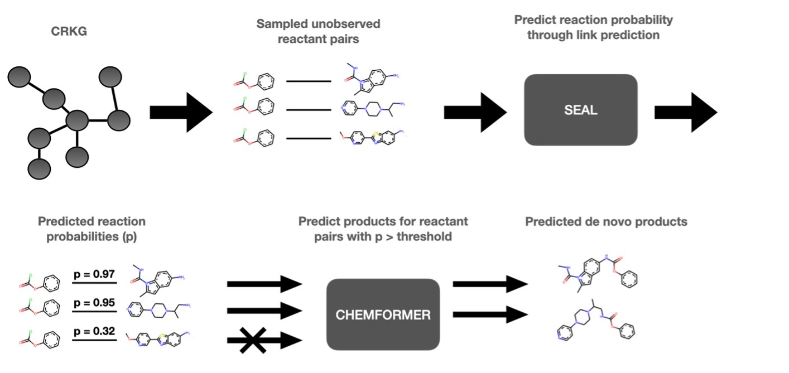

# Reaction Graph Link Prediction

**[Installation](#installation)**
| **[Data](#data)**
| **[Usage](#usage)**
| **[Contributors](#contributors)**
| **[Citation](#citation)**
| **[References](#references)**

This repository contains end-to-end training and evaluation of the SEAL [[1]](https://proceedings.neurips.cc/paper_files/paper/2018/file/53f0d7c537d99b3824f0f99d62ea2428-Paper.pdf) and Graph Auto-Encoder [[2]](https://arxiv.org/abs/1611.07308) link prediction algorithms on a Chemical Reaction Knowledge Graph built on reactions from USPTO. This code has been used to generate the results in [[3]](https://chemrxiv.org/engage/chemrxiv/article-details/64e34fe400bbebf0e68bcfb8).

In [[3]](https://chemrxiv.org/engage/chemrxiv/article-details/64e34fe400bbebf0e68bcfb8), a novel de novo design method is presented in which the link prediction is used for predicting novel pairs of reactants. The link prediction is then followed by product prediction using a transformer model, Chemformer, which predicts the products given the reactants. This repository covers the link prediction (reaction prediction) and for the subsequent product prediction we refer to the original [Chemformer](https://github.com/MolecularAI/Chemformer) repository. 

Link Prediction in this setting is equivalent to predicting novel reactions between reactant pairs. The code presented here is based on the implementation by Zhang et al. [[1]](https://proceedings.neurips.cc/paper_files/paper/2018/file/53f0d7c537d99b3824f0f99d62ea2428-Paper.pdf) of [SEAL](https://github.com/facebookresearch/SEAL_OGB/tree/main).



**Figure 1. Overview of the method.** (top) Step 1, link prediction in a Chemical Reaction Knowledge Graph (CRKG) using [SEAL](https://github.com/facebookresearch/SEAL_OGB/tree/main), and (bottom) Step 2, product prediction for highly predicted novel links using [Chemformer](https://github.com/MolecularAI/Chemformer). 

## Installation

After cloning the repository, the recommended way to install the environment is to use `conda`:

```bash
$ conda env create -f environment.yaml
```

## Data
Download the USPTO reaction graph from [here](https://doi.org/10.5281/zenodo.10171188) and place it inside the ```data/``` folder.

## Usage
Use this repository to train and evaluate our proposed model with,

```bash
$ python main.py --graph_path [PATH-TO-GRAPH] --name [EXPERIMENT-NAME]
```

Optional settings can be provided as additional arguments. The training script generates the following files,
- ```data/```: Processed data files.
- ```results/```: Individual folders containing all relevant results from a GraphTrainer, including
    - Checkpoints of model and optimizer parameters, based on best validation AUC and best validation loss separately. 
    - Log file of outputs from training, including the number of datapoints in train/valid/test split, number of network parameters, and more. 
    - Pickle files of all results from training and testing separately. 
    - Some preliminary plots.
    - Test metrics and test predictions in csv format. 
    - A csv settings file of the hyperparameters used for training.

### Hyperparameter optimization
Use our optimized parameters by default or run a new hyperparameter optimization with,

```bash
$ python optimize.py --graph_path [PATH-TO-GRAPH]
```

### Reproducibility
Once a SEAL model has been trained the probability of novel links can be predicted as follows,
```bash
$ python predict_links.py --model_dir_path [PATH-TO-TRAINED-SEAL] --save_path [SAVE-PATH] --graph_path [PATH-TO-GRAPH] --edges_path data/negative_links_uspto.csv
```

Exchange ```data/negative_links_uspto.csv``` with your potential links.

### Parallelization / Runtime
Most optimally, run with GPU available. In addition, SEAL-based link prediction is parallelizable on CPUs. Negative links generation by default uses a node degree distribution-preserving sampling function (sample_degree_preserving_distribution) which can take a long time depending on graph size. However, it only needs to be run once for a given link-sampling seed after which it is stored in ```data/```. Alternatively, an approximating function (sample_distribution) can be used with quicker runtime.

### Codebase

```torch_trainer.py``` contains the main trainer class and is called by the ```main.py```, ```optimize.py``` and ```predict_links.py``` individually.

The main script initializes and runs a GraphTrainer from the ```torch_trainer.py``` file. The training process utilizes the following modules:
- ```datasets/reaction_graph.py```: Importing graph and setting up training/validation/test positive edges. 
- ```datasets/seal.py```: Dynamic dataloader for SEAL algorithm, including sub-graph extraction and Double Radius Node Labelling (DRNL).
- ```datasets/GAE.py```: Dataloader for GAE algorithm.
- ```models/dgcnn.py```: The Deep Graph Convolutional Neural Networks used for the prediction of the likelihood of a link between the source and target nodes in the given subgraph.
- ```models/autoencoder.py```: Graph Autoencoder used for prediction of the likelihood of a link between the source and target nodes, implemented using Torch Geometric library.
- ```utils/```: various related functions used throughout the project. 

## License

The software is licensed under the Apache 2.0 license (see [LICENSE](https://github.com/MolecularAI/reaction-graph-link-prediction/blob/main/LICENSE)), and is free and provided as-is.

## Contributors
- [Emma Rydholm](https://github.com/emmaryd)
- Tomas Bastys
- [Emma Svensson](https://github.com/emmas96)

## Citation

Please cite our work using the following reference.
```bibtex
@article{rydholm2023expanding,
    title={{Expanding the chemical space using a Chemical Reaction Knowledge Graph}},
    author={Rydholm, Emma  and Bastys, Tomas and Svensson, Emma and Kannas, Christos and Engkvist, Ola and Kogej, Thierry},
    journal={ChemRxiv},
    doi={10.26434/chemrxiv-2023-qdvmm},
    year={2023}
}
```

## References:
[1] M. Zhang and Y. Chen, "Link prediction based on graph neural networks," Advances in neural information processing systems 31, 2018.

[2] T. N. Kipf and M. Welling, "Variational Graph Auto-Encoders", Neural Information Processing Systems 2016.

[3] E. Rydholm, T. Bastys, E. Svensson, C. Kannas, O. Engkvist and T. Kogej, "Expanding the chemical space using a Chemical Reaction Knowledge Graph,"  ChemRxiv. 2023

[4] R. Irwin, S. Dimitriadis, J. He and E. Bjerrum, "Chemformer: a pre-trained transformer for computational chemistry," Machine Learning: Science and Technology. 2022, 31 Jan. 2022. 

## Keywords
Link prediction, chemical reactions, synthesis prediction, forward synthesis prediction, transformer, chemical space, de novo design, knowledge graph, reaction graph

